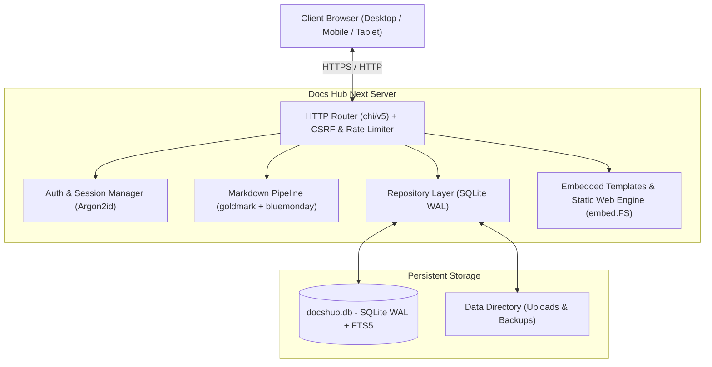

# Docs Hub Next

<div align="center">

[](https://golang.org)
[](LICENSE)
[](.github/workflows/ci.yml)
[](https://sqlite.org)
[](SECURITY.md)
[]()

**High-performance, lightweight, self-hosted enterprise knowledge base and documentation wiki.**  
*Combines the bidirectional graph intuition of Obsidian with robust server-side RBAC, revision history, and FTS5 search.*

[English](README.md) · [Русская версия](#обзор-на-русском) · [Architecture](docs/ARCHITECTURE.md) · [API Docs](docs/API.md) · [Deployment Guide](docs/DEPLOYMENT.md) · [Roadmap](docs/ROADMAP.md)

</div>

---

## ⚡ Highlights & Key Capabilities

- **🚀 Single Binary Simplicity**: Built with pure Go and embedded static assets. Zero external daemon dependencies required.
- **🧠 Bidirectional Knowledge Topology**: Full support for wiki-links `[[slug]]` and `[[slug|Label]]`, automatic backlink extraction, and dynamic 2D SVG Knowledge Graph visualization.
- **⚡ SQLite WAL Persistence**: Robust ACID transactions, FTS5 full-text indexing, and automatic migrations replacing fragile JSON flat-files.
- **🎨 Neo-Swiss Editorial Design**: Clean architectural typography, fluid responsive layout ($320\text{px} \to 3840\text{px}$), 8 curated accent presets, and dark/light mode with zero flash-on-load.
- **🛡️ Enterprise-Grade Security**:
  - Argon2id password hashing with runtime salt generation.
  - Server-side cryptographically signed session tokens.
  - Strict Per-request CSRF protection on all state mutations.
  - IP token-bucket rate limiting against brute-force attacks.
  - Strict HTML sanitization via `bluemonday` and `goldmark` GFM engine.
- **📊 Real-time Diagramming**: Native Mermaid.js sequence, flow, and class diagram rendering inside Markdown reading and editing canvases.
- **🗂️ Organizational Spaces & Granular RBAC**: Multi-space isolation (`Engineering`, `Product`, `Operations`), role-based permissions (`admin`, `editor`, `reader`), and complete audit event trailing.
- **📱 Touch & Mobile Optimized**: Safe-area aware (`env(safe-area-inset-*)`), responsive drawer navigation, localized code scrolling, and mobile bottom sheet dialogs.

---

## 🏗️ Architecture & Technology Stack



| Layer | Technology | Details |
| :--- | :--- | :--- |
| **Runtime** | Go 1.25+ | Pure Go, compiled binary with cross-platform targets |
| **HTTP Engine** | `chi/v5` | Lightweight middleware stack with structured `slog` logging |
| **Persistence** | `modernc.org/sqlite` | Embedded CGo-free SQLite with WAL mode, foreign keys & FTS5 |
| **Markdown** | `goldmark` + `bluemonday` | CommonMark + GFM extensions, auto-linking, XSS sanitization |
| **UI & Styling** | Vanilla CSS + HTML5 | Fluid Neo-Swiss design tokens, zero external CSS dependencies |
| **Testing** | Go Test + Playwright | Race detection, security baseline tests, and cross-browser E2E |

---

## 🚀 Quickstart

### Option A: Docker Compose (Recommended for Production)

1. Clone the repository:
   ```bash
   git clone https://github.com/homiakus/Docs_Hub.git
   cd Docs_Hub
   ```

2. Generate environment configuration:
   ```bash
   cp .env.example .env
   # Edit .env and set strong ADMIN_PASSWORD (min 8 chars) and SESSION_SECRET (min 16 chars)
   ```

3. Launch the container stack:
   ```bash
   docker compose up -d --build
   ```

4. Access your wiki at `http://localhost:8080` (or the configured `HOST_PORT`).

---

### Option B: Local Binary / Development

1. Ensure Go 1.23+ is installed on your system.
2. Initialize environment:
   ```bash
   cp .env.example .env
   ```
3. Run the development server:
   ```bash
   go run ./cmd/docshub
   ```

### Option C: Automated Management Script (PowerShell)

On Windows or PowerShell Core, use the enterprise management utility:
```powershell
# Setup environment, build, and launch
.\manage.ps1 -Action Run

# Execute test suite with race detector
.\manage.ps1 -Action Test

# Seed database with demo data
.\manage.ps1 -Action Seed
```

---

## ⚙️ Configuration Reference

All settings can be configured via environment variables or a `.env` file in the working directory:

| Variable | Type | Default | Description |
| :--- | :--- | :--- | :--- |
| `ADMIN_PASSWORD` | String | **Required** | Initial administrator password (minimum 8 characters) |
| `SESSION_SECRET` | String | **Required** | Cryptographic key for session cookies (min 16 characters) |
| `ADMIN_USER` | String | `admin` | Initial administrator username |
| `ADDR` | String | `:8080` | Internal server listen address |
| `HOST_PORT` | Integer | `8080` | External host port mapped by Docker Compose |
| `DATA_DIR` | String | `./data` | Directory for SQLite database and uploaded attachments |
| `SITE_NAME` | String | `Docs Hub Next` | Brand name displayed in header, status bar, and metadata |
| `COOKIE_SECURE` | Boolean | `0` | Set to `1` when serving over HTTPS to enable `Secure` cookie flag |
| `LOG_LEVEL` | String | `info` | Logging verbosity (`debug`, `info`, `warn`, `error`) |
| `RATE_LIMIT_ENABLED` | Boolean | `true` | Enable token-bucket IP rate limiter |
| `RATE_LIMIT_RPM` | Integer | `60` | Max requests per minute per IP address |
| `RATE_LIMIT_BURST` | Integer | `10` | Maximum burst capacity for rate limiter |
| `TLS_ENABLED` | Boolean | `0` | Enable direct TLS termination in Go server |
| `TLS_CERT_FILE` | String | `""` | Path to TLS certificate file |
| `TLS_KEY_FILE` | String | `""` | Path to TLS private key file |

---

## 📡 REST API & Integrations

Docs Hub provides a high-performance REST and JSON API for automation:

- `GET /healthz` — System liveness & database connectivity health probe.
- `GET /api/graph` — Complete node and edge topology for knowledge graph visualizers.
- `GET /api/v1/search/suggest?q={query}` — Instant full-text search suggestions.
- `PUT /api/v1/documents/draft` — Real-time document autosave endpoint.
- `POST /api/uploads` — Multipart media asset upload (images, audio, video).
- `POST /api/preview` — Real-time server-side Markdown compilation.

For full payload contracts and authentication headers, refer to [docs/API.md](docs/API.md).

---

## 🧪 Testing & Quality Gates

Docs Hub enforces rigorous test suites to ensure absolute stability:

```bash
# Execute unit and security tests with race condition detector
make test

# Generate test coverage report
make test-cov

# Run code linter
make lint

# Run Playwright End-to-End browser suite
cd tests/e2e && npm test
```

---

## 🇷🇺 Обзор на русском

**Docs Hub Next** — это современная, производительная корпоративная wiki-система и база знаний, вдохновлённая Obsidian, но созданная для совместной работы в команде.

### Главные преимущества:
1. **Единый бинарник**: Написан на чистом Go, не требует установки Node.js, Python или внешних серверов баз данных в рантайме.
2. **База данных SQLite WAL**: Быстрый полнотекстовый поиск FTS5, надёжные транзакции, поддержка версионирования каждой статьи.
3. **Двунаправленные связи**: Поддержка синтаксиса `[[wiki-links]]`, автоматический учёт обратных ссылок (backlinks) и интерактивный граф знаний.
4. **Безопасность корпоративного уровня**: Хеширование паролей Argon2id, серверные сессии, защита от CSRF и Rate Limiting.
5. **Адаптивный дизайн**: Neo-Swiss швейцарская сетка, поддержка светлой/тёмной темы, выбор акцентного цвета, идеальная работа на смартфонах, планшетах и 4K-мониторах.

---

## 📚 Documentation Index

- 📐 **[Architecture Overview](docs/ARCHITECTURE.md)** — Architectural design principles, data flow, and DB schema.
- 📡 **[API Reference](docs/API.md)** — REST endpoints, authentication tokens, and request/response specifications.
- 🚢 **[Deployment Guide](docs/DEPLOYMENT.md)** — Production setups with Docker, Nginx, Caddy, systemd, and backups.
- 🗺️ **[Project Roadmap](docs/ROADMAP.md)** — Development milestones and feature timelines.
- 🛡️ **[Security Policy](SECURITY.md)** — Vulnerability reporting and encryption protocols.
- 🤝 **[Contributing Guide](CONTRIBUTING.md)** — Development workflows, branch naming, and pull request standards.
- 📜 **[Changelog](CHANGELOG.md)** — Release notes and version history.

---

## 📄 License

Docs Hub Next is open-source software licensed under the [MIT License](LICENSE).
