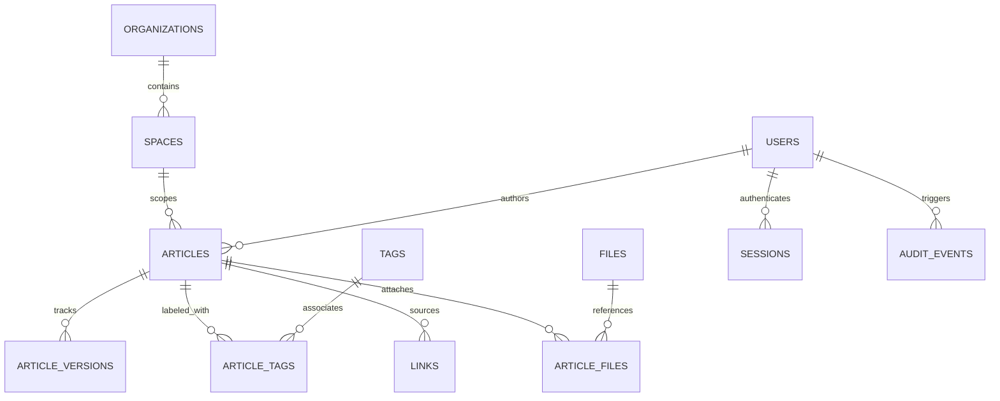
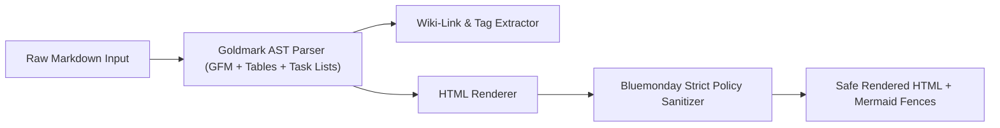

# System Architecture — Docs Hub Next

## 1. Overview & Architectural Vision

Docs Hub Next is designed as a **zero-dependency, single-binary, self-hosted enterprise knowledge base**. Unlike legacy document management systems that require complex multi-container orchestration or heavyweight JVM runtimes, Docs Hub combines the speed and simplicity of embedded SQLite with modern knowledge graph ergonomics inspired by Obsidian.

### Core Architectural Axioms
1. **Zero External Runtime Dependencies**: Standard deployment consists of a single statically compiled Go binary with embedded HTML/CSS/JS web assets.
2. **Local-First Speed with Multi-User Governance**: Lightning-fast page loads through embedded SQLite WAL and in-memory caches, paired with strict server-side authentication, CSRF tokens, and RBAC authorization.
3. **Markdown as the Universal Interchange Format**: Content is persisted as standard CommonMark / GitHub Flavored Markdown (GFM) with extended wiki-links `[[slug]]`, tags `#tag`, and Mermaid diagram fences.
4. **Resilient Data Integrity**: Full ACID guarantees via transactions, automated schema migrations, and point-in-time backup capabilities.

---

## 2. Package & Layer Structure

```text
Docs_Hub/
├── cmd/
│   ├── docshub/             # Application entrypoint & HTTP server bootstrap
│   ├── docshub-seed/        # Demo data generator & developer seeder
│   └── migrate-json/        # Migration utility for legacy JSON storage files
├── internal/
│   ├── application/         # Core application services (document, template, workflow, AI)
│   ├── auth/                # Argon2id password hashing and secret generation
│   ├── authn/               # Session management and OIDC identity authentication
│   ├── authz/               # Space and role-based access authorization rules
│   ├── config/              # Environment variable loading & validation logic
│   ├── db/                  # SQLite connection pool, WAL settings & embedded SQL migrations
│   ├── domain/              # Core domain entities, models, and value objects
│   ├── files/               # Media asset storage and file validation services
│   ├── httpapp/             # Chi HTTP router, handlers, middleware & CSRF protection
│   ├── markdownx/           # Markdown AST compiler, link extraction, sanitization
│   ├── repository/          # Repository contracts and SQLite implementation
│   ├── store/               # Legacy store compatibility and migration interfaces
│   └── web/                 # Embedded HTML templates, CSS tokens, and JavaScript assets
└── docs/                    # Architectural decisions, API specifications & guides
```

---

## 3. Storage Engine & Database Schema

Docs Hub utilizes embedded SQLite operating in **Write-Ahead Logging (WAL)** mode. This delivers concurrent reads without blocking writes and sub-millisecond query latencies.

### Key Schema Tables



### Table Specifications
- **`articles`**: Master document record containing `id`, `slug`, `title`, `status` (`draft`, `in_review`, `published`, `archived`), `visibility` (`authenticated`, `private`, `public`), `lock_version` for optimistic locking, and category foreign keys.
- **`article_versions`**: Immutable snapshot of every revision containing full `content`, pre-rendered `rendered_html`, `author_id`, and timestamp.
- **`article_fts`**: SQLite FTS5 virtual table providing full-text search across document titles, content, and tags with BM25 ranking.
- **`links`**: Bidirectional link index tracking `from_article_id`, `target_slug`, and `label`. Enables $O(1)$ backlink queries and graph traversal.
- **`spaces` & `organizations`**: Logical isolation boundaries for multi-team access control.
- **`audit_events`**: Append-only security and operational audit trail tracking actor, action, IP address, and change metadata.

---

## 4. Markdown & Security Pipeline

Content processing follows a strict multi-stage compilation and sanitization pipeline to guarantee security and performance:



1. **AST Transformation**: `goldmark` parses CommonMark with GFM extensions (tables, strikethrough, autolinks).
2. **Wiki-Link Resolution**: Custom AST traverser resolves `[[slug]]` and `[[slug|Display Text]]` into relative `/a/{slug}` routes.
3. **XSS Sanitization**: `bluemonday.UGCPolicy()` strips all malicious `<script>`, `<iframe>`, `onerror`, and unauthorized protocols. Safe SVGs, audio/video players, and code blocks are preserved.
4. **Client Rendering**: Mermaid code blocks (`<pre class="mermaid">`) are dynamically rendered on the client canvas.

---

## 5. Security & Threat Modeling

- **Password Storage**: Argon2id with recommended OWASP parameters (memory: 64MB, iterations: 3, parallelism: 2, 16-byte random salt).
- **Session Tokens**: Cryptographically random 32-byte tokens stored in SQLite with TTL expiry and strict `SameSite=Lax`, `HttpOnly` cookie flags.
- **CSRF Defense**: Double-submit cryptographic token pattern verified on all non-idempotent HTTP methods (POST, PUT, DELETE).
- **Brute-Force Rate Limiting**: In-memory token-bucket limiter restricting login attempts and global request rates per remote IP.
- **Optimistic Concurrency**: `lock_version` integer verification on article edits preventing silent overwrites during concurrent edits.

---

## 6. Frontend Architecture

The user interface is built on a **Neo-Swiss Editorial Grid System** utilizing vanilla modern CSS and progressive JavaScript:
- **Design Tokens**: Centralized CSS custom properties for surfaces (`--surface-*`), typography scales (`--font-*`), and motion curves (`--ease-*`, `--motion-*`).
- **Responsive Geometry**: Fluid container queries and `clamp()` calculations adapting flawlessly from $320\text{px}$ mobile screens to $3840\text{px}$ 4K displays.
- **Theme & Accent Engine**: Perceptual Dark/Light themes with instant client-side switching and customizable accent palettes persisted via `localStorage`.

---

## 7. Enforced Architecture Boundaries

The current remediation program is defined by `docs/DEEP_AUDIT_REMEDIATION_MASTER_PLAN_2026-08-27.md` and its active evidence addendum `docs/ARCHITECTURE_LEVERAGE_AND_FRAGILITY_AUDIT_2026-09-06.md`.

The modular-monolith direction is retained. The goal is not to create more layers or services, but to make unsafe alternate execution paths impossible or mechanically detectable.

### 7.1 Non-negotiable invariants

1. **Trusted principal and tenant scope on every user operation.** A handler cannot invent or default the active organization/workspace. The principal is derived from trusted server-side identity/session state and organization membership is part of effective authorization.
2. **One authorization path per resource operation.** Authentication alone is never sufficient for a resource mutation. Access scope is applied before search ranking, graph expansion, aggregation, activity ordering or `LIMIT`.
3. **Transport is persistence-blind.** `internal/httpapp` parses transport input, resolves the trusted principal, invokes application services and translates results. It does not execute SQL or own business transactions.

### 7.2 Target dependency direction

```text
HTTP / Web / Bot / future API
            |
            v
      Trusted Principal
            |
            v
+----------------------------+
| Application Use Cases      |
| Document / Comment /       |
| Search / Workflow Services |
+-------------+--------------+
              |
       Policy + Port Contracts
              |
       +------+-------+
       |              |
       v              v
Security Authority     Repositories
       |              |
       +------+-------+
              v
        Persistence Adapter
```

Forbidden steady-state dependency direction:

```text
HTTP -> database/sql
HTTP -> concrete SQLite repository
HTTP -> duplicated ACL policy
```

### 7.3 Repository safety rule

The default user-facing repository API must not expose unrestricted resource getters. Reads and writes that can be reached from a user request require an explicit scope/capability.

Preferred shape:

```go
type ReadScope struct {
    PrincipalID    int64
    OrganizationID int64
    WorkspaceIDs   []string
}

GetVisibleByID(ctx context.Context, scope ReadScope, id int64) (*domain.Article, error)
```

Unrestricted access, if needed for migrations/system jobs, belongs to a deliberately named system-only interface and is auditable.

### 7.4 Application transaction ownership

Transactions follow business invariants, not individual tables. A document save may need to update content, immutable revision history, links/search state and audit records atomically. The application service owns that transaction boundary through an explicit transaction/Unit-of-Work port.

### 7.5 Security authority and caches

Process-local maps and caches are never authoritative for access decisions. Security state must have a persistent/external source of truth; cache invalidation must be defined, and stale cache state may never widen permission.

### 7.6 Architecture fitness functions

The following properties are intended to become machine-enforced repository gates:

```text
FIT-001  internal/httpapp does not import database/sql.
FIT-002  internal/httpapp does not call Query/Exec/BeginTx directly.
FIT-003  protected user resource queries require trusted Principal/Scope.
FIT-004  non-idempotent resource endpoints have negative authorization tests.
FIT-005  activity/search/graph/backlinks scope data before ranking/LIMIT.
FIT-006  applied migration content is immutable/checksummed.
FIT-007  process restart does not change effective access permissions.
FIT-008  fault injection cannot leave multi-write use cases partially committed.
```

Architecture conventions that are not expressed as tests or static checks are considered temporary controls.

### 7.7 SQLite operating envelope

SQLite remains the preferred storage engine for the single-binary deployment model until measurement proves otherwise. WAL, foreign keys and busy timeout are intentional. Connection serialization and write contention must be treated as an explicit capacity boundary rather than a reason for speculative migration.

The project must maintain a reproducible benchmark for concurrent reads, autosave/search/audit writes and define p95 latency plus lock/busy error thresholds. A PostgreSQL adapter is justified when measured product requirements exceed that envelope, not before.

### 7.8 Structural refactoring policy

Refactoring uses a strangler approach. Complete vertical use cases are extracted from `httpapp.Server` one at a time (comments, document save/autosave, revisions, sessions, search, workflow/admin), while preserving the modular monolith.

An extraction is complete only when the old bypass path is removed. Adding a service while keeping direct SQL/business logic in HTTP does not satisfy the architecture boundary.
