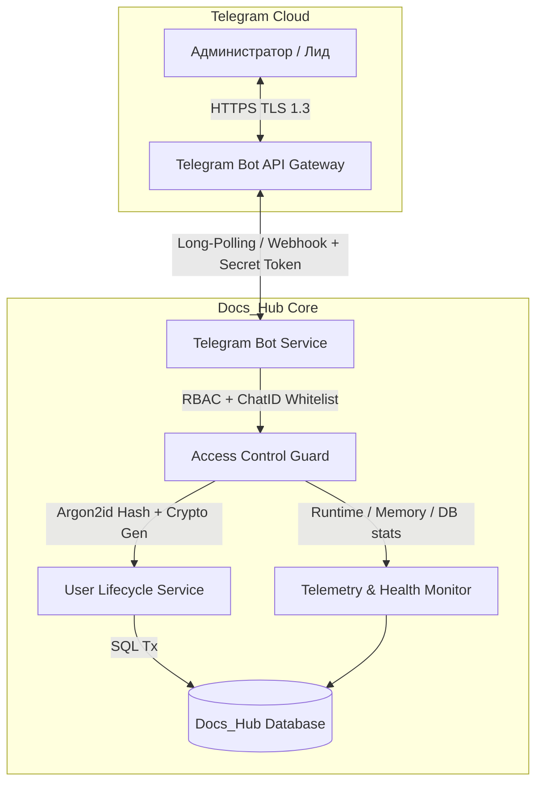

# Исследование лучших мировых практик (World Best Practices): Telegram ChatOps & Enterprise Knowledge Base Bots

> **Область исследования**: Интеграция Telegram-ботов для управления базами знаний, онбординга пользователей, ChatOps, мониторинга и безопасности корпоративных систем.  
> **Стандарты и референсы**: Telegram Bot API 7.x, NIST SP 800-63B (Digital Identity Guidelines), OWASP Telegram/ChatOps Security Guidelines, GitLab/Slack ChatOps Architecture.

---

## 1. Архитектурная модель: ChatOps & Telegram Administration

---

## 2. Ключевые мировые практики по направлениям

### 2.1. Безопасность и управление доступом (Security & Identity)
1. **Strict Chat ID Whitelisting & Secret Tokens**:
   - Привязка административных команд строго к `TELEGRAM_CHAT_ID` администратора или доверенной группы.
   - Игнорирование любых неавторизованных запросов без раскрытия деталей архитектуры.
2. **HTML/Markdown Injection Defense**:
   - Любой пользовательский ввод (логины, имена, заголовки статей, ошибки БД) обязан экранироваться через `html.EscapeString()` во избежание Parse Errors и инъекций управляющих тегов Telegram.
3. **Argon2id Password Storage**:
   - Генерация паролей с энтропией не менее 80+ бит (`crypto/rand`, длина ≥ 14 символов, исключение визуально похожих символов `0/O`, `1/l/I`).
   - Пароли в базе хранятся исключительно в виде хэшей `Argon2id` (v=19, memory=64MB, t=3, p=2).
4. **Session Invalidation upon Reset / Block**:
   - При сбросе пароля (`/reset_password`) или блокировке (`/block_user`) немедленно отзывать все активные токены сессий (`DELETE FROM sessions WHERE user_id=?`).

---

### 2.2. Онбординг и управление пользователями (User Lifecycle & RBAC)
1. **Быстрый онбординг через Telegram Handle (`/invite @username [role]`)**:
   - Создание профиля с автоматической генерацией пароля и немедленной выдачей готовой карточки для копирования.
2. **Мгновенное переключение ролей (`/set_role`)**:
   - Ролевая модель:
     - `admin` — полный контроль системы, управление правами, просмотр всех разделов;
     - `editor` — создание, редактирование статей, управление тегами и категориями;
     - `reader` — доступ к просмотру и комментированию материалов.
3. **One-Click Actions через Inline Keyboards**:
   - Использование `InlineKeyboardMarkup` и `CallbackQuery` для быстрой навигации без необходимости ввода текстовых команд на мобильных устройствах.

---

### 2.3. Мониторинг состояния и Telemetry (Observability)
1. **Server Healthcheck (`/status`)**:
   - Аптайм процесса, проверка соединения с БД (SQLite WAL), потребление памяти (`runtime.MemStats`: Alloc / Sys), количество активных горутин.
2. **Knowledge Base Analytics (`/stats`)**:
   - Метрики активности: общее число статей, количество опубликованных документов, черновиков, открытых веток комментариев, число пользователей по ролям.
3. **Proactive Alerts (Broadcast Notifications)**:
   - Возможность отправки уведомлений в чат администратора о критических событиях (старт сервиса, сбои, регистрация новых пользователей).

---

## 3. Сводная таблица реализованных команд

| Команда | Описание | Результат выполнения |
| :--- | :--- | :--- |
| `/start`, `/help` | Справка и интерактивное меню | Выводит руководство и кнопки быстрых действий |
| `/status`, `/health` | Телеметрия и состояние сервера | Аптайм, RAM, горутины, статус БД, порт |
| `/stats` | Сводная статистика контента | Счётчики статей, черновиков, пространств, пользователей |
| `/users` | Список пользователей | Таблица последних 15 пользователей с ролями и статусами |
| `/add_user <login> [role]` | Добавление пользователя | Генерирует 14-значный пароль, сохраняет хэш, возвращает карточку входа |
| `/invite <@tg> [role]` | Онбординг по Telegram | Создаёт аккаунт по Telegram-хэндлу с паролем |
| `/set_role <login> <role>` | Изменение прав | Назначает роль (`admin`, `editor`, `reader`) |
| `/reset_password <login>` | Сброс пароля | Генерирует новый пароль и сбрасывает активные сессии |
| `/block_user <login>` | Блокировка пользователя | Устанавливает `is_active=0` и аннулирует сессии |
| `/unblock_user <login>` | Разблокировка пользователя | Восстанавливает `is_active=1` |
